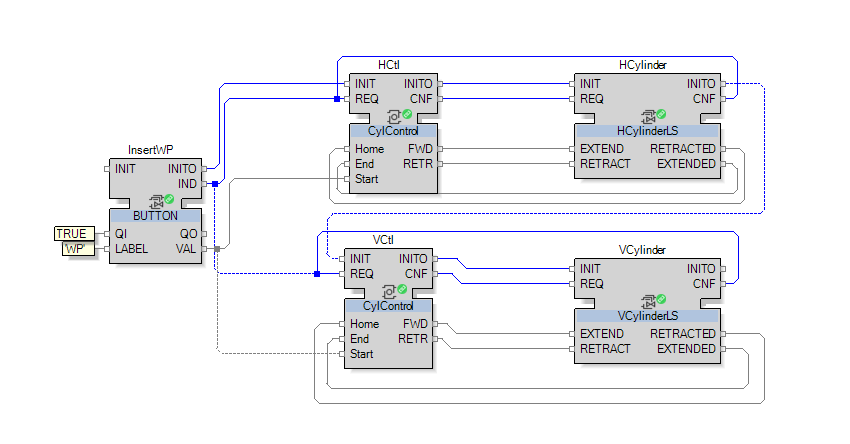

# Function Block Composition and Bi-Directional Adapters (IEC 61499)

This lab project focuses on composing IEC 61499 applications from library function blocks and organizing communication through adapter connections, including bi-directional adapters, deployed across multiple soft PLCs.

## Lab Focus

The lab is dedicated to composing applications from library function blocks and the use of adapters.  
The special task within this lab is related to creation of bi-directional adapter connections.

## Learning Objectives

In this lab:

- Compose the application from library elements.
- Deploy an application to several soft PLCs.
- Create and use adapter connections between function blocks.
- Organize bi-directional adapter connections.

## Technologies and Tools

- IEC 61499 function block applications  
- Library function blocks (standard and custom)  
- Adapter and bi-directional adapter constructs  
- EcoStruxure Automation Expert / soft PLC runtime  
- Multi-device deployment configuration

## Basic Application Structure

## Adapter connections

## Bi-Directional Adapter connections

